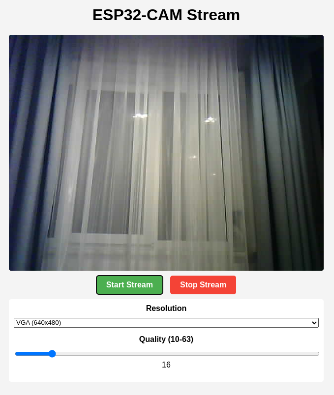

# ESP32-CAM Webcam Example with PlatformIO


## Fork changes - minimal streaming with esp32cam

This fork provides a minimal working example of a video stream with the ability to change quality and resolution settings through a simplified web interface. The interface is designed to be lightweight and user-friendly, focusing on the core functionality of the ESP32-CAM.



### Features

- Clean, simple web interface
- Live video stream
- Resolution adjustment (from QQVGA to UXGA)
- Quality adjustment (10-63)
- Start/Stop stream controls

### Modifying the Web Interface

If you want to modify the web interface, follow these steps:

1. Edit the `minimal_camera_interface.html` file in the root directory
2. Convert the HTML file to a compressed binary format using the provided Python script

```bash
python3 convert_html_to_h.py minimal_camera_interface.html src/camera_index.h
```

The script will:
- Compress the HTML content using gzip
- Convert it to a C header file format
- Create identical compressed data for both OV2640 and OV3660 cameras
- Place the header file in the src directory

After modifying the interface, run the conversion script and then compile and upload the firmware to your ESP32-CAM device.

--- 

## Description

This is the example code from [CameraWebServer.ino](https://github.com/espressif/arduino-esp32/blob/master/libraries/ESP32/examples/Camera/CameraWebServer/CameraWebServer.ino) converted to a PlatformIO compilable project. 


## Configuration

### Camera model 

Known camera models can be selected at the top of the `main.cpp` in the selection

```cpp
// Select camera model
//#define CAMERA_MODEL_WROVER_KIT // Has PSRAM
//#define CAMERA_MODEL_ESP_EYE // Has PSRAM
//#define CAMERA_MODEL_M5STACK_PSRAM // Has PSRAM
//#define CAMERA_MODEL_M5STACK_V2_PSRAM // M5Camera version B Has PSRAM
//#define CAMERA_MODEL_M5STACK_WIDE // Has PSRAM
//#define CAMERA_MODEL_M5STACK_ESP32CAM // No PSRAM
#define CAMERA_MODEL_AI_THINKER // Has PSRAM
//#define CAMERA_MODEL_TTGO_T_JOURNAL // No PSRAM
```

These pins then map to the [src/camera_pins.h](https://github.com/maxgerhardt/pio-esp32cam/blob/main/src/camera_pins.h) defintions. 

If you have custom camera pins that does not follow the known cameras, you must modify and add these pins to the `camera_pins.h` file.

### Board configuration

The `platformio.ini` currently configures the project for an ESP-WROVER chipset (has PSRAM), with the flash in QIO mode at 80MHz.

If these settings are not correct for you, change the file with your correct `board = ..` value and other settings accordingly to the [PlatformIO board documentation](https://platformio.org/boards).
